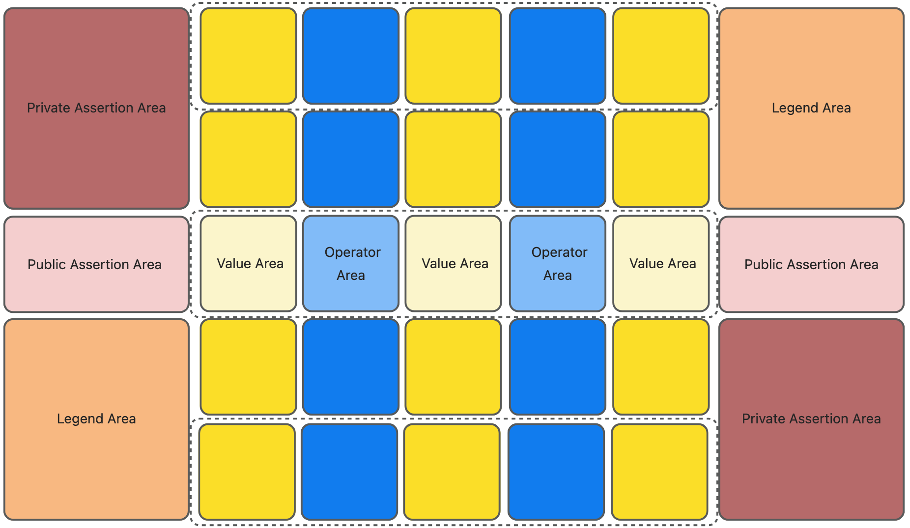
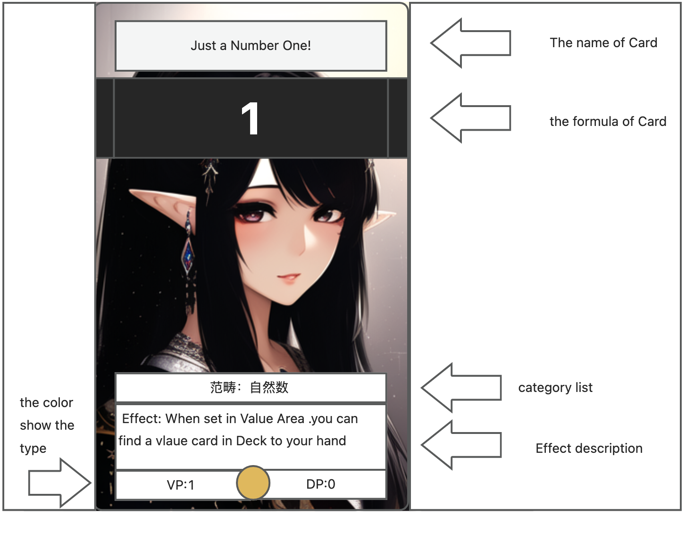

# Full Rule

Firstly, this is a tabletop game with a mathematical background. The goal is to obtain more victory points（VP） under limited game conditions.

## Victory conditions
- When either side surrenders at any time, the other side wins
- When the game ends, calculate the victory points. The specific calculation method is explained in the "End of Game Scoring" section. Victory points can be negative. The player with more victory points wins. 
- If the VP are tied, the player with the most psuedo-victory points (PVP) wins.
- If the VP and PVP are tied, it is a draw.

## Conditions for 'End of Game Scoring'
- When either player enters the end phase of their turn, and there are no cards left in the deck before the start of their opponent's turn, the game ends, and end of game scoring begins.
- The game ends instantly when either player reaches 10 or more PVPs, and end of game scoring begins.
- When either player enters the end phase of their turn and all public lanes in the game are occupied, the game ends, and end of game scoring begins. 

## Gameplay process.

### Preparation before the game begins

Both players should check each other's decks before the game begins.
- Each deck must consist of at least 40 cards and not exceed 60 cards
- The total number of victory points on assertion cards must not 
exceed the number of cards in the player's deck.

Afterwards, both parties `flip a coin` to determine who goes first. Each person starts with 5 `initial hand cards`.
- The first player draws one less card during their "draw phase" in the first turn.
The game begins, and each player takes turns to play their respective rounds. The game will end when the termination conditions are met, and a 'End of Game Scoring' will take place.

### phases in turn
Each player's turn consists of the following phases:
- turn start phase
- standby phase
- draw phase
- action pahse
- end pahse

#### Turn start phase
turn start phase. Some card effects are triggered during this phase. Turn start phase cannot be skipped. After the turn start phase, standby phase is executed.

#### Standby phase
Standby phase.Some card effects are triggered during this phase.After the  Standby phase ,draw phase is executed.

#### Draw phase
- draw phase,Some card effects are triggered during this phase.After the draw phase ,action pahse is executed.
- Except for the first turn of the player who goes first, each player can draw two cards from the remaining deck during their draw phase. (The player who goes first in their first turn can only draw one card.)
- When there is only one card left in the deck, draw a card from the top of the discard pile to ensure that two cards are added to the hand.

#### Action pahse
Action phase is the main phase of the game. Cards in the game can be used. They have the following types:
- Value Card
- Operator Card
- Assertion Card
- Function Card
- Legend Card

The usage of each type of card is relatively complicated and will be introduced in the later rules

#### End pahse
- End pahse,Some card effects are triggered during this phase.
- Before the end of the end phase, it is necessary to check the number of cards in the current player's hand. If it is greater than 7, the excess cards need to be discarded to the discard pile, and the player needs to deduct the pseudo victory point equal to the number of discarded cards from their total points (if there are any).
- After the end phase, it is the opponent's turn to start a new turn.

## Game Field
The game field consists of lanes (public/private), value area, operator area, assertion area (public/private), and legend area as shown in the following figure:

- The five areas enclosed by the dotted lines above are arranged in a row (alternating between value and operator areas, for a total of 5), and are called lanes.
- There are a total of 5 lanes. The light-colored one in the middle is the public lane, and the rest are private lanes. There is only one public lane, and each player has two private lanes.
- The yellow area is the value area, typically used to place value cards.
- The blue area is the operator area, typically used to place operator cards.
- The red and light-red areas are the assertion area. The ones on both sides of the public lane are the public assertion area, with one on the left and one on the right. Each player only has one private assertion area.
- The orange area is the legend card area. The legend card area can hold up to four legend cards.

With the above concepts, we can better understand the cards and their corresponding operations.

## Cards and their usage methods.

### Colors and Types of Cards.
he type and function of a card is determined by its color. The basic colors are as follows
- Value card: Yellow.
- Operator card: Blue.
- Assertion card: Red
- Function card: Green.
- Legend card: Orange.

These colors only represent the basic functions of general cards, and there may be special mixed colors indicating combined functions.
- Yellow/Red: Can be considered as both value cards and assertion cards.
- Blue/Yellow: Function cards can be used not only for temporary function calculation, but also for setting up “operator-value” on function cards. However, they cannot be used for function effects (see function cards for details).
- Blue/Green/Yellow: Function cards can be used not only for temporary function calculation and setting up “operator-value” on function cards, but also for using function effects (see function cards for details).
- Rainbow color: Generally appears on legend cards and can be used as a card for effect description.

### Card Field.

- Name of card.
- Card Formula.Regardless of the name of the card, the corresponding values in the formula are the main factors in the 'End of Game Scoring'.
- Card Category List. Represents a property of cards. Some effects are targeted towards this property.
- Effect description：There is a triggering timing and effect mentioned above.
- Card color. See “Colors and Types of Cards”. It determines what operations can be performed on the card.
- VP,DP: Victory points and defeat points. These are values that only assertion cards have.

> PS: The female character on the top of the card has no correlation with the game. The design of the card is temporary and only needs to reflect the necessary information.

### Card Introduction

The following explains how to use the card.

---

#### Value Card
- Set Value Card.The operation of set a value card is to show a value card from your hand, place it face up in the value area, and treat it as if it has been set.
- There can only be one value card in each value area at most.
- Each time the value card is setted, it can only be setted "nearest".
- "Nearest" placement means that the value card can only be placed from left to right. In addition, except for the first value area from the left, which can be placed directly, when placing a value card in other areas, it must be ensured that the left side of the area has been filled with cards.
- Because you and your opponent face each other, your opponent places cards from right to left while you place cards from left to right. The result is a shared lane for both of you to place cards in opposite directions.
- Move Value Card. The operation of moving the value card is to select a value card you placed and move it parallelly down or up one lane to the value area of another lane.
-  You can only choose the cards you set up in your private lane and public lane to move them to your adjacent private lane. That is to say, you cannot move cards from your private lane to the public lane.
-  In general, you cannot move a card when there are cards in the adjacent lanes.
-  When moving cards, you do not need to follow the "nearest" principle.
- You can only place a value card or move a value card once per turn.
- After setting the value, you cannot have both the set operator and the value card in the public lane in the same turn.

--- 

#### Operator Card
- Placing an operator card. The operation of placing an operator card is to show one operator card in your hand, place it with the front side up on the value area, and regard it as setting an operator.
- There can be at most one operator card in each operator area.
- Each time an operator is placed, it can only be placed "nearest".
- you can only place one operator per turn.
- After setting an operator, you cannot have both the set operator and value card in the public lane in the same turn.
- The operator card follows the operator language: `?` indicates that the order can be exchanged, which can benefit oneself in interpretation. `L/R` indicates left and right expressions, and the order cannot be changed. See "Calculating the Value of a Lane" for specific usage.

--- 

#### Assertion Card

- Setting an assertion card. The assertion card is placed face up in the private or public assertion area.
- Each turn, a maximum of one assertion card can be placed in both the public and private assertion areas.
- Both public assertion areas can be used for placing assertion cards. However, a maximum of one assertion card can be placed in each public assertion area per turn.
- After an assertion card is placed, its effect can be activated based on the description of the assertion card.

---

#### Function Card

Function cards are the most complex and flexible cards in the game. They mainly have three possible ways of use:

- Temporary Calculation of Functions
- Using Function Effects
- Setting the "operator-value" operation.

Temporary Calculation of Functions
- Temporary Calculation of Functions. When using this function, you can find any value or operator on the field as long as its value is used as an input parameter for the function. If the output parameter matches, remove these values immediately and gain the pseudo-victory points marked on the function card (which can usually be counted by a 20-sided die).
- Using the temporary calculation of functions is a good way to remove cards from the field.
- Any card can be treated as a value card. This can include cards on your own field or on your opponent's field.
- After use, the function card is discarded, and the value cards used as input parameters and output parameters are discarded in the order of appearance. (If it's an opponent's card, it goes to their discard pile.)
- The order of cards in the discard pile is fixed, and effects that allow you to retrieve cards from the discard pile do not change the order of the discarded cards.

Using Function Effects
- The function card must be marked with green to use its effect.
- This card can be used between phases. Use the effect described on the card. If the effect cannot be activated, treat it as using a function card and discard it to the top of the discard pile.
- Traditionally, when you want to use a function card that has nothing to do with mathematics, you need to say to your opponent "Sorry bro, I'm going to use pure magic from the math magic card!"

Setting the "operator-value" operation.
- Setting an operator/value operation is considered as placing a value card and an operator card in the lane at the same time (which means that this cannot be done in the public lane based on previous restrictions). When using this feature, the function card should be placed horizontally between the operator and value positions, starting from the operator position. It represents using the preceding value as the input parameter of the function, and the calculated result as the value of the subsequent item. For example, if you use the function "y = 3x" to place an operator-value operation with the value of 3, in the assertion calculation it will be represented as "3 * 3 = 9", and the left expression of the next operator will start with 9.

---

#### Legend Card
- Activating a Legendary Card. According to the effect of the card, place it in the Legendary Card area and activate its effect.
- There are only four card slots in each Legendary Card area. When all four slots are occupied, if you want to activate a new Legendary Card, you need to discard one of the existing Legendary Cards to the top of the discard pile before activating the new one.
- Rainbow Legendary Cards are not bound by the Legendary Card position restrictions.

## End of Game Scoring
This is the last topic of this game, understanding the way of final calculation can help you make better decisions during the game.

- The value of a lane. The calculation of values and operators in a lane is done in one direction, ultimately resulting in a value or function known as the value of the lane.
-  The calculation of a private lane is done from left to right.
-  The calculation of a public lane is done by calculating the combined VP of the assertion cards in both sides of the public lane. The calculation is done from the small end to the large end.
-  If the combined VP of assertion cards in both sides of a public lane is equal, then the player going second gets to choose the calculation order.
-   A calculation composed of the value of a lane and the assertion area is called a calculation combination
-   Each player's victory points are determined by three calculation combinations.
    - Private lane + public assertion area: If an assertion is incorrect, it must be dealt with.
    - Public lane + private assertion area: If an assertion is incorrect, it must be dealt with.
    - Private lane + private assertion area: Incorrect assertions can be ignored and only the correct ones recorded.
-  When calculating in a lane, what to do with an empty position depends on the situation
   -  If a value cannot be calculated, then no calculation combination judgment will be made.
   -  Calculation is only performed when a value can be formed.
- Each player can specify the calculation order in a lane value calculation using operator language, but they can only declare it once.
- The responsibility for ensuring the correctness of necessary assertions falls on the opponent, and it is the player's responsibility to supervise
-  The player is responsible for ensuring the correctness of assertions that can be ignored, and the opponent is responsible for supervising.
- When both sides cannot prove the truth or falsehood of an assertion, the game should be judged as a draw until such time as the assertion can be proved true or false.
