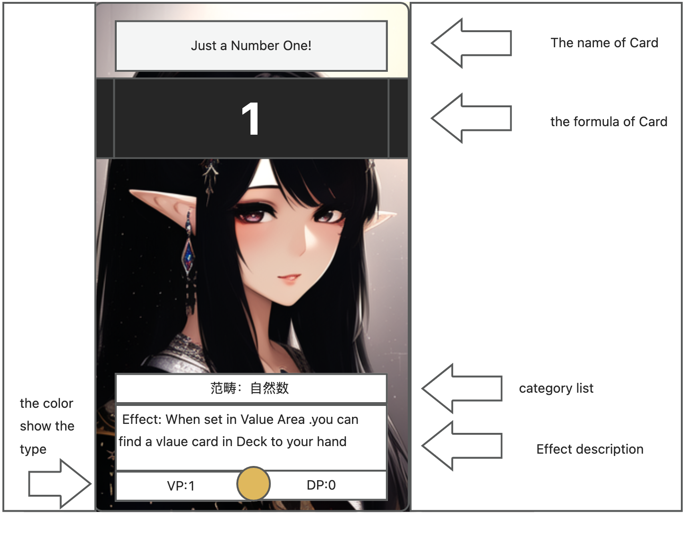

# 完整规则

首先这是一个以数学为背景的桌游。目标是在有限的游戏条件下获得更多的胜利点数。

## 胜利条件
- 当有任意一方在任意时间投降时，由另外一方获得胜利。
- 当游戏进行终止结算时。计算胜利点数。胜利点数的计算详细见‘游戏进行终止结算’。胜利点可以为负数。拥有胜利点数多的一方获胜。
- 当胜利点数一样时，拥有最多伪胜利点数的一方获胜。
- 胜利点数和伪胜利点数都一样时。双方平局。

## 发生游戏终止结算条件
- 当任意一方在回合结束阶段后，对手回合开始之前。剩余卡堆没有卡片时,游戏终止，并开始进行终止结算。
- 当任意一方获得10个或者更多伪胜利点数的瞬间进行，游戏终止，并开始进行终止结算。
- 当任意一方在回合结束阶段开始之前，公共泳道牌位已经被占满时，游戏终止，并开始进行终止结算。

## 游戏流程

### 游戏开始前准备

由双方在比赛开始之前互相检查对手牌组。
- 其中每个卡组至少有40张卡构成，并且不超过60张。
- 其中断言卡的胜利点数总和不大于其牌组数目

之后双方`猜硬币`决定先后手。每人5张`初始手卡`。
- 先攻者第一回合的抽卡阶段少抽一张卡。
开始游戏,双方轮流进行回合。直到游戏达到终止结算条件进行结算。

### 回合内的阶段
每个牌手在进行自己的回合时都会经历以下阶段。
- 开始阶段
- 准备阶段
- 抽卡阶段
- 行动阶段
- 结束阶段

#### 开始阶段
回合开始阶段。部分卡片效果针对这一阶段发动。回合开始阶段不能被跳过。开始阶段结束后执行回合准备阶段。

#### 准备阶段
回合准备阶段。部分卡片效果再这一阶段生效。准备阶段结束后进入到抽卡阶段。

#### 抽卡阶段
- 抽卡阶段。部分卡片效果在这一阶段生效。抽卡阶段结束后进入到行动阶段。
- 除了先攻的第一个回合，每次抽卡阶段的一方可以从剩余牌堆中抽取两张卡。（先攻的第一回合只能抽取一张）
- 当剩余牌堆卡片只剩一张时。从弃置牌堆的最上方摸一张卡。保证有两张卡进入到手牌。

#### 行动阶段
行动阶段是游戏的主要阶段。可以使用游戏中的卡片。他们有以下几种。
- 值卡
- 算子卡
- 断言卡
- 函数卡
- 传奇卡

其中每种卡的使用相对复杂会在后面的规则中介绍。

### 结束阶段
- 结束阶段。部分卡片效果由此阶段生效。
- 结束阶段结束前，需检查当前行动玩家的手卡数目，不能大于7张，如果大于7张的情况，需要丢弃多余的卡到弃牌堆，并扣除丢弃卡个数的伪胜利点数。（如果没有则不扣除）。
- 结束阶段后，换做对手进行他的新回合。

## 游戏场地
游戏场地中由泳道（公共/私有），值区，算子区，断言区(公共/私有)，传奇卡区构成。如下图：

- 上方虚线围住的五个区域在一排的，(值区和算子区交替出现，总共5个)叫做泳道。
- 总共有5条泳道。最中间的浅色的是公共泳道。其余的是私有泳道。公用泳道只有一个。每个玩家有两个私有泳道。
- 黄色的区域是值区。通常用来放置值卡。
- 蓝色的区域是算子区，通常用来放置算子卡。
- 红色和浅红色是断言区。在公共泳道两侧的是公共断言区。他们一左一右共两个。每个玩家只有一个私有断言区。
- 橙色的区域是传奇卡区。传奇卡区最多放置四个传奇卡。

有了上面的概念，才可以更好的理解卡片。和他们对应的操作。

## 卡片及其使用方法

### 颜色和卡片的种类
卡片的类型和功能由它的颜色决定。基础的颜色如下。
- 值卡： 黄色
- 算子卡： 蓝色
- 断言卡： 红色
- 函数卡： 绿色
- 传奇卡： 橙色

这些颜色只是一般卡的基本功能也存在比较特殊的混合颜色表示混合功能：
- 黄色/红色: 既可以视为值卡又可以视为断言卡。
- 蓝色/黄色：函数卡除了‘函数临时结算’外。还可以进行函数卡的‘算子-值’设置。不能使用函数效果（详细见函数卡）
- 蓝色/绿色/黄色：函数卡除了‘函数临时结算’外。还可以进行函数卡的‘算子-值’设置。还可以使用函数效果（详细见函数卡）
- 彩虹色：一般出现在传奇卡中，可以作为效果描述的卡使用。

### 牌面字段

- 卡片名称
- 卡片的公式。无论卡片名称是什么，游戏终止结算时以公式对应的值为主。
- 卡牌的范畴列表。表示卡片的一种属性。部分效果是针对这一属性的。
- 效果描述。上面有发动的时机和效果。
- 卡片颜色。见‘颜色和卡片的种类’，决定卡片可以进行哪些操作。
- VP,DP: 胜利点数和失败点数。只有具有断言卡功能的卡才有的数值。

> PS: 上方牌面的女性和游戏没有任何关系。上面的卡片设计为临时，只要能体现这些信息即可。

### 卡片介绍